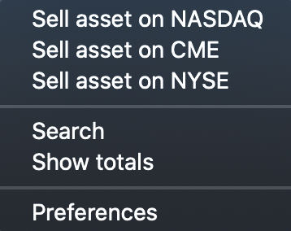

# Assets

Assets panel contains information about all assets by the chosen account\(-s\). If there is the same asset on different accounts, then it is displayed for each account in the corresponding table rows.

### 
**Columns**

A user can choose the columns, which will be displayed by right-click on one of the column names.

The following columns are available in the panel:

* Asset name – name of the asset, which is set on a server.
* Default symbol – allows showing the instrument name from the setting ‘Pricing instrument’.
* Trading exchange – allows showing the exchange which is set on a server for the Default symbol.
* Account – name of the account, which contains the asset.
* Start day qty – asset quantity at the user’s account at the beginning of a day. While logging in it is sent from a server.
* Start day qty. for margin available – while logging in, the user gets information from the correspondent field on a server.
* Today traded qty – the quantity of the asset which was traded by all instruments for which this asset was pre-selected, but only for Product type=Delivery. The quantity of all Buy trades is counted with ‘+’, the quantity of all Sell trades is counted with ‘-‘.
* Available qty. for sell – quantity of the asset, which is available for sell.

  If Today traded qty.&gt;=0, then Available for sell = Start day qty.

  Otherwise, Available for sell = Start day qty. - \|Today traded qty.\|

* Current price – current Last price on the instrument Default symbol.
* Current value for sell – current asset value available for selling. Current value for sell = Available for sell \* Current price \* CrossPrice.
* Liquidity rate% – the price of each asset at the user's account can be used for the opening of a position by other instruments. This price should be counted in Margin available in that interest proportion which is defined in this setting. Default value is 0. Maximal value is 100.
* Sell asset – allows to launch Order entry in order to sell asset.
* Sell exchange – allows showing a combo box with all exchanges where the asset is traded. Also you can sell asset on the chosen exchange via the context menu of the certain asset.

You can choose the columns, which have to be displayed by right-click on one of the columns.

The same menu allows to filter data in a table, reset the panel's view to factory defaults and to open the 'Assets Preferences' window.

### **Context menu**

Right-click on the asset evokes the context menu which includes the following options:

* Sell asset – allows to sell the asset on the chosen exchange;
* Search – allows to show/hide a Search lookup in the panel;
* Show totals – allows to show/hide the row showing the total values for columns;
* Preferences – opens the 'Assets Preferences' menu.

