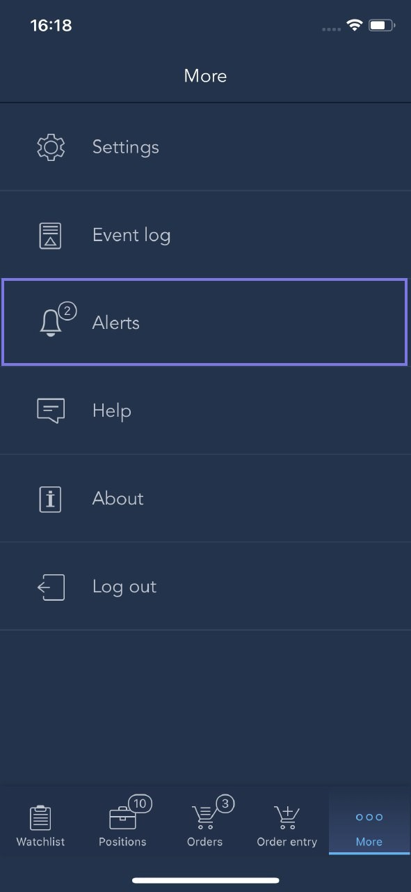

# Alerts

In order to take advantage of the alerts, the user should open the ‘More’ tab and select the appropriate item that comes after the Event log:

To set up a new alert, tap the ‘Create new’ button located in the general Alerts screen. The alert creation menu looks as follows, the user can also find Bid, Ask, Last, Change%, and Volume data by the selected instrument here:

Alert creation screen contains the following settings:

* Symbol – standard lookup for instrument selection;
* Action – allows to select the action that will take place when the alert is triggered, the available values are:
  * Place order + Notify – alert is performed according to notification type and order placing occurs;
  * Notify – user is notified without placing an order;
* Order parameters – appears only if Action is set to ‘Place order + Notify’. At this point, there is an ‘Order entry’ button by clicking on which a full form for placing an order will be opened;
* Notification type – combobox for selecting the type of notification, multiselect is available:
  * Email – an alert containing the text from the ‘Alert message’ field will be sent to the user by email;
  * Push notification – an alert containing the text from the ‘Alert message’ field will be sent to the user via push notification;
  * Pop-up – an alert containing the text from the ‘Alert message’ field will be sent to the user in pop-up message;
  * Sound – a musical alert will be played to the user in the client.
* Alert type – allows to set an alert type. Available options are: Ask, Bid, Last, Change%, Volume;
* Condition – allows to set an alert condition. Available values are: &gt;,&lt;,&gt;=,&lt;=;
* Value – allows to set a value of Alert type for reaching the condition;
* Importance – allows to define the alert importance. The following options are available: High, Medium, Low. After the alert execution, the user gets a notification with the corresponding color of the indicator which depends on importance of the alert;
* Expiration – date/time picker that allows specifying the period of the alert lifetime;
* After execute – allows to select alert behavior after execution. Available options are ‘Stop’ - alert is not active but stored in the list of alerts, and ‘Remove’ - alert is removed after execution;
* Alert message – input field for entering the alert message text. The text in the message box is generated automatically in accordance with the alert parameters, but the user can customize the notification text if needed;
* Create button – tap this one after setting the alert parameters. The ‘Create’ button is colored in accordance with the alert importance.

### Alerts management

In the Alerts panel, the user can browse through and work with already created alerts, both executed or not. Next to the panel name, there is a counter displaying the number of all created alerts.

The alert management screen contains a table that lists all created alerts as well as controls for performing certain actions:

* Symbol – name of the instrument for which the alert was created;
* Condition – displays the condition upon reaching which the alert must be executed;
* Controls – set of controls for each alert, namely:
  * Play – this button is visible for executed alerts only, tapping it will restart the alert with existing settings;
  * Stop – this button is visible for non-executed alerts only, tapping this button will stop the alert;
  * Edit – allows to open the editing screen, this screen is similar to the Create alert;
  * Remove – this button allows to remove the existing alert.
* Create button – tap this one to open the alert creation screen.

### Alerts on chart

The chart displays all active alerts for the instrument selected in the symbol lookup. If the alert is executed, it will not be shown on the chart, but its presence in the panel is controlled by the ‘After execute’ parameter. The chart displays all alerts for an instrument, for Ask, Bid, Last types. 

In order to create a new alert, the user should perform a long tap on the needed price scale level. At the level where the long tap was made, an alert label will appear, it contains a confirmation button for setting an alert:

If the alert was set at the wrong level, the user can simply drag the alert label to the required level, and only then press the confirmation button. When creating an alert on a chart by long tap, the following parameters are applied to it:

* Symbol – symbol for which the chart is opened;
* Alert type – data type for which the chart is opened;
* Condition – if the alert is set above the current price then &gt;=, if the alert is set below the current price then &lt;=;
* Value – price value at the level where the alert is set;
* Importance – always Medium;
* Expiration – +30 days from the time of the alert placement;
* After execute – always Stop;
* Action – always Notify;
* Notification – several notifications will be selected, namely Email, Pop-up, Push;
* Message – notification text will be formed in accordance with the alert parameters.

In order to edit or remove the alert, the user should use the corresponding buttons, which become visible by tapping the alert label:

Tapping the Edit button will result in opening the corresponding screen, it is similar to the one intended for creating the alert. Editing the alert from the chart is also possible by using the Drag&Drop function. When using it, the alert is modified without additional confirmation, just drag the alert to the required position.

