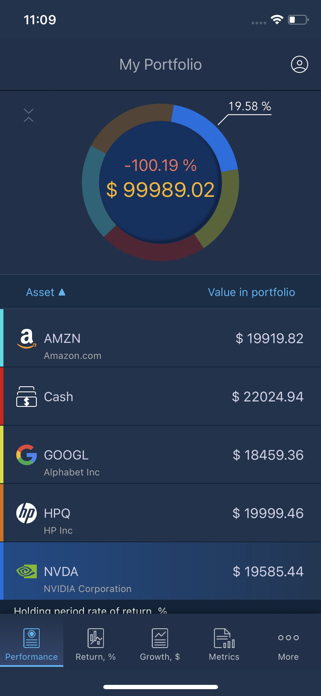

# Performance

The Performance screen is accessible by default after opening the “My Portfolio” functionality.

### Account lookup

If a user has several Investor accounts, he can choose a certain account by tapping the Account lookup which is displayed instead of the “My Portfolio” header, and select the preferred account from the list.

### Diagrams

To show/hide the diagram, tap the  button. The following types of diagrams are displayed:

* Pie chart - shows the amount of funds that were invested into the Portfolio considering “Portfolio balance” as well as “Holding period rate of return” from the moment of investment.
* Doughnut chart - shows the “Portfolio allocation” values. The number of chart sectors corresponds to the number of assets in the portfolio as well as Cash. If there is no portfolio \(positions\) at the account, the chart will be plain and Cash will be displayed. The allocation will be dynamic as it will be built by the current investor’s portfolio. 

### Cards

Under the diagram a user can find cards that show assets/cash included in the portfolio.

The following information is displayed on each card:

* asset name;
* instrument description;
* money equivalent of the asset share in the portfolio \(Stock value\); 
* money equivalent of the Cash share in the portfolio is calculated by the formula:

_Cash value in portfolio,$ = ProjectedBalance - sum\(StockValue\)_

To open full information by the asset/Cash, tap the corresponding card.

* Holding period rate of return, % - chart shows the rate of return by a single asset/Cash since the moment of investment by days.
* Symbol type - shows the type of the traded symbol.
* Trading exchange - shows a trading exchange where the instrument is traded.
* Target allocation - shows a target allocation. The allocation is taken from the model which is assigned to the account.
* Current price - shows a current market price.
* Quantity - shows quantity in lots.

The colors of the cards correspond to the colors of chart sectors. Tap a certain card to see the share of the asset/Cash in the portfolio on the diagram.

