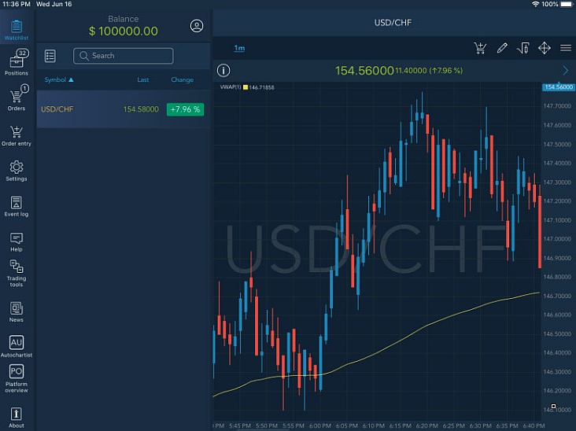

# VWAP \(Volume weighted average price\)

Volume weighted average price \(VWAP\) is a technical analysis tool used to measure the average price weighted by volume. VWAP is typically used with intraday charts as a way to determine the general direction of intraday prices. VWAP is similar to a moving average in that when the price is above VWAP, prices are rising and when the price is below VWAP, prices are falling. VWAP is primarily used by technical analysts to identify the market trend.

VWAP is used to identify liquidity points. As a volume weighted price measure, VWAP reflects price levels weighted by volume. This can help institutions with large orders. The idea is not to disrupt the market when entering large buy or sell orders. VWAP helps these institutions determine the liquid and illiquid price points for a specific security over a very short time period.

VWAP can also be used to measure trading efficiency. After buying or selling a security, institutions or individuals can compare their price to VWAP values. A buy order executed below the VWAP value would be considered a good fill because the security was bought at a below average price. Conversely, a sell order executed above the VWAP would be deemed a good fill because it was sold at an above average price.

## Calculation

Volume weighted average price \(VWAP\) is exactly what it sounds like: the average price weighted by volume. VWAP equals the currency value of all trading periods divided by the total trading volume for the current day. The calculation starts when trading opens and ends when trading closes. Because it is good for the current trading day only, intraday periods and data are used in the calculation.

VWAP = \(∑j Pj \* Vj\) / ∑j Vj

Where:

Pj – price of the trade j;

Vj – volume of the trade j;

j – each individual trade that takes place over the defined period of time, excluding cross trades and basket cross trades.

Price\(i\)= \(High+Low+Close\)/3

## Main parameters

* Days number, number of days involved in calculation of 1 indicator’s cycle;
* Start day time, defines the start time of the client's trading day, i.e. defines the start of the VWAP calculation cycle \(valid for the client's timezone\);
* End day time, defines the end time of the client's trading day, i.e. defines the end of the VWAP calculation cycle \(valid for the client's timezone\);
* Line style.

The values of the Start day time and End day time controls form a time interval within which the VWAP indicator value is calculated. The indicator looks as follows on chart:

