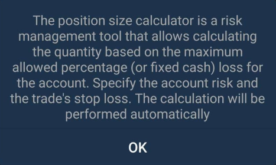

# Position sizing

Position sizing is the size of a position within a portfolio or the dollar amount that an investor is going to trade. It allows investors to control risk and maximize returns. When determining appropriate position sizing, an investor's account size and risk tolerance are taken into account.

If the Position sizing function is available, then thebutton will be displayed next to the “Quantity” field.

When a user taps this button for the first time, the following info screen will be shown:

If a user unchecks the "Show next time" setting, the next time the button is tapped, the info screen will not be shown. When a user taps the “Ok” button on the info window, additional fields will appear in the Order entry screen for automatic calculation of the quantity. When tapping the Position sizing button, it turns yellow and the “Quantity” field becomes disabled.

* Account risk - the amount of losses for the account selected in the lookup. A user can select the risk unit in the auxiliary control section: Fixed or Percentage:
* Fixed - the currency of the account that is selected in the Order entry is displayed in the auxiliary section;
* Percentage - percentage is displayed in the auxiliary section.
* Percentage risk/Cash risk - recalculation into the opposite risk unit. If Fixed is specified in the Account risk, then here the Percentage will be displayed and vice versa.
* SL with the ability to enable Trailing stop - allows setting the SL level in absolute or in offset. It depends on the condition of the “Set SL/TP values in offset” setting.
* SL limit price - the parameter is displayed when the “Use stop limit instead of Stop” is activated in the General setting.
* SL offset/SL price - recalculation into the value that is opposite to the value in the “SL price” field. If “SL price” is displayed, then “SL offset” value will be displayed here and vice versa.

Note: if SL is forbidden, then the Position size calculator will be disabled.

## Calculations

Quantity with consideration of the propensity to risk, is calculated by the formula:

_**Quantity = \(Risk per trade, ccy \* crossPrice\) / Risk per share**_ ,

where:

* Risk per trade - risk propensity in the account currency. This is the value that a user enters into the “Account risk” field. If a value is entered in percentage, then it will be determined how much it is in the account currency by the formula: \(Available funds \* Risk,%\) / 100%;
* crossPrice - cross rate from the account currency to the quote currency of the instrument;
* Risk per share is calculated by formulas:

<table>
  <thead>
    <tr>
      <th style="text-align:left"></th>
      <th style="text-align:left"></th>
      <th style="text-align:left">For the quote currency tickCost/tickSze</th>
    </tr>
  </thead>
  <tbody>
    <tr>
      <td style="text-align:left">When <b>Set SL/TP values in offset = false:</b>
      </td>
      <td style="text-align:left">
        
<b>Risk per share = abs(Price - SL price)</b> or

        
<b>Risk per share = abs(Price - SL limit price)</b> if <b>Use Stop limit instead of Stop</b> is
          used

      </td>
      <td style="text-align:left"><b>Risk per share = abs(Price - SL price)*tickCost/tickSize</b>
      </td>
    </tr>
    <tr>
      <td style="text-align:left">When <b>Set SL/TP values in offset = true</b> and <b>Show offset in = Ticks:</b>
      </td>
      <td style="text-align:left">
        
<b>Risk per share = SL offset * tick size</b> or

        
<b>Risk per share = (SL offset + SL limit offset) * tick size</b> if <b>Use Stop limit instead of Stop</b> is
          used

      </td>
      <td style="text-align:left"><b>Risk per share = SL offset * tickCost</b>
      </td>
    </tr>
    <tr>
      <td style="text-align:left">When <b>Set SL/TP values in offset = true</b> and <b>Show offset in = Points:</b>
      </td>
      <td style="text-align:left">
        
<b>Risk per share = SL offset</b> or

        
<b>Risk per share = (SL offset + SL limit offset)</b> if <b>Use Stop limit instead of Stop</b> is
          used

      </td>
      <td style="text-align:left"><b>Risk per share = SL offset*tickCost/tickSize</b>
      </td>
    </tr>
    <tr>
      <td style="text-align:left">When <b>Set SL/TP values in offset = true</b> and <b>Show offset in = Ticks (fractional ticks for Forex):</b>
      </td>
      <td style="text-align:left">
        
<b>Risk per share = SL offset * 10 * tick size</b> or

        
<b>Risk per share = (SL offset + SL limit offset) * 10 * tick size</b> if <b>Use Stop limit instead of Stop</b> is
          used

      </td>
      <td style="text-align:left">The same as for offset in ticks</td>
    </tr>
  </tbody>
</table>

