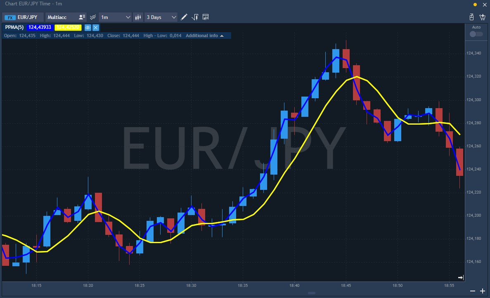

# PPMA \(Pivot point moving average\)

Pivot point analysis is a method of identifying key levels that the price can respond to. Pivots tend to act as support or resistance and can be turning points. This method is commonly used by day traders, although the concepts are valid in different time frames.

This indicator was designed to smooth out market noise and show market trends more clearly. The goals are achieved in the same way as in the case of the simple moving average indicator. The only difference is the original price used to calculate the two indicators: simple moving average uses any price from the list of data sources \(mainly the closing price\), while PPMA uses Pivot point values ​​that are calculated for each period. Whether used alone or in combination with other methods, pivots are a useful tool in a technical trader's toolbox.

## Calculation

Pivot Point = \(High + Low + Close\) / 3 \( Typical Price \)

PPMA = SMA\(Pivot Point, period\), where

SMA = Simple Moving Average

period = calculation time period

## Main parameters

* Period of PPMA – allows to specify the number of periods, over which the indicator is to be calculated. The smaller the number is, the less market noises the indicator filters, and the faster it reacts to the market price changes.
* Win num on chart for indicator – allows to display the indicator in a separate window. Available values: Main and Sub window.

This indicator looks as follows on the chart:

