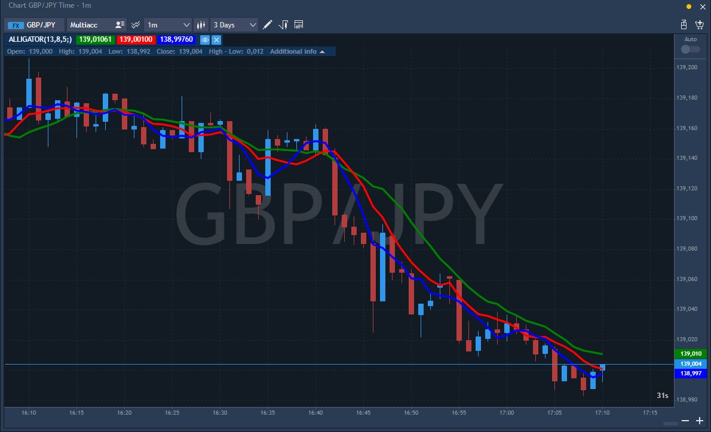

# Alligator

The Alligator Indicator was initially developed by psychologist and technical trader Bill Williams, one of the earliest pioneers of market psychology. The trend-following indicator Alligator, which is based on the assumption that financial markets and individual stocks only trend 15% to 30% of the time, while moving sideways ranges from the other 70% to 85% of the time. Williams believed that individuals and organizations tend to make most of their profits during periods of a strong trend.

The Alligator Indicator finds its most common usage in identifying trending and ranging markets. In terms of its interpretation, an analogy to an alligator is often used, thereby giving it its name. The indicator itself consists of three lines, typically colored Blue, Red, and Green, which are usually named as follows:

1. The blue line \(Alligator's jaw\) is the Balance Line for the timeframe that was used to draw the chart \(13-period Smoothed Moving Average, moved into the future by 8 bars\);
2. Red Line \(Alligator's teeth\) is the Balance Line for the timeframe value one level below \(8-period Smoothed Moving Average, moved by 5 bars into the future\);
3. Green Line \(Alligator's lips\) is the Balance Line for the timeframe value one more level lower \(5-period Smoothed Moving Average, moved by 3 bars into the future\).

The aims of this indicator are as follows:

* Make the indicator convenient for trading only in the current deal;
* Develop a reliable way to save money when the market bounded by the price channel moves;
* Provide a unified way to monitor market movements.

When traders use the Alligator indicator to identify trending and ranging markets, an alligator analogy is commonly employed for illustration purposes. Basically, when all of the mythological alligator’s parts or Balance Lines converge and are plotted close to one another, that means the alligator is sleeping or nearly asleep and his mouth is closed. This signals that a ranging market prevails.

However, the more the creature sleeps, the hungrier it gets, and the first thing it does upon waking is yawning. Then it smells a bull or a bear and starts to hunt its prey as the indicator’s Balance Lines begin to separate and his mouth opens.

An uptrend is indicated if the price trades above the alligator’s mouth, which consists of its jaw, teeth, and lips - the blue, red, and green lines respectively. These lines also need to be aligned with an upward slope so that the green is on top of the red on top of the blue, all of which is below the price.

Conversely, a downtrend is indicated when the price trades below the alligator’s mouth. In this case, the lines should also be aligned, but with a downward direction, with the blue line above the red, which is above the green, and all come in over the price.

Once the alligator has killed and eaten sufficiently, it begins to lose interest and fall asleep again, prompting the blue, red, and green Balance Lines to converge and cross over as its mouth closes. This indicates the time to take profits has arrived and the trend is over.

### Calculation

Median price \(n\) = \[High \(n\) + Low\(n\)\] / 2

Alligator’s jaw \(Blue line\) = SMMA \(Median price \(n\), 13, 8\)

Alligator’s teeth \(Red line\) = SMMA \(Median price \(n\), 8, 5\)

Alligator’s lips \(Green line\) = SMMA \(Median price \(n\), 5, 3\)

Where:

* n = the number of time periods;
* High \(n\) = the high price traded during the n time period;
* Low \(n\) = the low price traded during the n time period;
* SMMA \(A, B, C\) — Smoothed Moving Average. A parameter is for data to be smoothed, B is the smoothing period, C is a shift to the future. For example, SMMA \(MEDIAN PRICE, 5, 3\) means that the smoothed moving average will be calculated on the median price, smoothing period being equal to 5 bars and shift being 3.

This indicator looks as follows on the chart:

